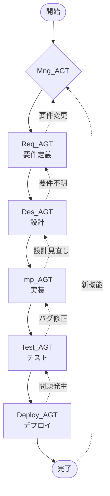

# フェーズ遷移ワークフロー

## 概要

メンター駆動開発における各フェーズ間の遷移は、プロジェクトの進行において重要な判断ポイントです。このドキュメントでは、フェーズ遷移の条件、プロセス、およびエージェント間の引き継ぎ方法を定義します。

## フェーズ遷移マップ



## フェーズ遷移の原則

### 1. 前進条件

各フェーズから次のフェーズへ進むための明確な条件を定義します。

```yaml
transition_rules:
  forward:
    principle: "完了基準を満たした場合のみ前進"
    verification: "チェックリストによる確認"
    approval: "メンティーの承認必須"
```

### 2. 後退条件

問題が発見された場合の適切な後退ルールを設定します。

```yaml
transition_rules:
  backward:
    principle: "ブロッカー発生時は適切なフェーズへ後退"
    documentation: "後退理由の記録"
    learning: "後退も学習機会として活用"
```

## 各フェーズの遷移詳細

### 開始 → マネジメント (Mng_AGT)

```yaml
transition:
  from: START
  to: Mng_AGT

  trigger:
    - new_project_request
    - new_feature_request
    - improvement_request

  actions:
    - project_initialization
    - context_gathering
    - initial_assessment

  handoff_data:
    - project_description
    - constraints
    - timeline
```

**遷移時の対話例:**

```
User: 新しいWebアプリを作りたいです

Mng_AGT: プロジェクトを開始します。まず全体像を把握しましょう。

【初期評価】
- プロジェクトタイプ: Webアプリケーション
- 推定規模: 確認中
- 優先事項: 確認中

いくつか確認させてください...
[質問による情報収集]

評価完了。要件が不明確な部分があるため、
Req_AGTに引き継ぎます。
```

### マネジメント → 要件定義 (Req_AGT)

```yaml
transition:
  from: Mng_AGT
  to: Req_AGT

  conditions:
    - requirements_unclear: true
    - scope_undefined: true
    - stakeholder_alignment_needed: true

  handoff_package:
    metadata:
      transition_reason: "要件の明確化が必要"
      priority_areas: ["機能要件", "非機能要件"]

    context:
      project_goals: string
      constraints: list
      initial_scope: string

    instructions:
      focus_areas: list
      questions_to_answer: list
```

**遷移プロセス:**

```
Mng_AGT: 要件定義フェーズに移行します。

【引き継ぎ情報】
プロジェクト: タスク管理アプリ
目的: チーム作業の効率化
制約: 3ヶ月以内にMVPリリース

【Req_AGTへの指示】
以下を明確化してください：
1. ユーザーペルソナ
2. 主要機能の詳細
3. 非機能要件

Req_AGT: 引き継ぎを確認しました。
要件定義を開始します。
```

### 要件定義 → 設計 (Des_AGT)

```yaml
transition:
  from: Req_AGT
  to: Des_AGT

  conditions:
    - functional_requirements: documented
    - non_functional_requirements: defined
    - acceptance_criteria: established
    - priority: determined

  quality_gates:
    - requirements_review: passed
    - completeness_check: passed
    - feasibility_confirmed: true

  handoff_package:
    requirements:
      functional: list
      non_functional: list
      constraints: list

    priorities:
      must_have: list
      should_have: list
      could_have: list

    recommendations:
      architecture_hints: string
      technology_suggestions: list
```

**品質ゲート確認:**

```
Req_AGT: 要件定義が完了しました。品質確認を行います。

【チェックリスト】
✅ 機能要件: 15項目定義済み
✅ 非機能要件: 8項目定義済み
✅ 受入基準: 全項目に設定
✅ 優先順位: MoSCoW分析完了
✅ レビュー: メンティー承認済み

Des_AGTへの引き継ぎ準備完了。

User: 確認しました。設計に進めてください。

Des_AGT: 要件を受領しました。設計フェーズを開始します。
```

### 設計 → 実装 (Imp_AGT)

```yaml
transition:
  from: Des_AGT
  to: Imp_AGT

  conditions:
    - architecture_defined: true
    - detailed_design: completed
    - task_breakdown: completed
    - tech_stack: decided

  quality_gates:
    - design_review: passed
    - feasibility_check: passed
    - risk_assessment: completed

  handoff_package:
    design:
      architecture_diagram: url
      component_design: document
      data_model: schema
      api_specification: openapi

    tasks:
      breakdown: wbs
      dependencies: graph
      priorities: list
      estimates: hours

    guidelines:
      coding_standards: document
      testing_strategy: document
```

**タスク引き継ぎ例:**

```
Des_AGT: 設計完了。実装タスクを整理しました。

【実装タスク概要】
Phase 1 (基盤): 3タスク, 8時間
Phase 2 (認証): 4タスク, 6時間
Phase 3 (CRUD): 6タスク, 12時間

【最初のタスク】
T1.1: プロジェクト初期設定
- 見積: 2時間
- 依存: なし
- 優先度: Critical

Imp_AGT: タスクを受領しました。
T1.1から実装を開始します。
```

### 実装 → テスト

```yaml
transition:
  from: Imp_AGT
  to: Test_AGT

  conditions:
    - implementation: completed
    - unit_tests: passed
    - integration_ready: true

  handoff_package:
    implementation:
      source_code: repository
      test_coverage: percentage
      documentation: updated

    test_requirements:
      test_cases: list
      test_data: prepared
      environments: configured
```

## エラー時の遷移

### 要件不明による後退

```
Imp_AGT: 実装中に要件の曖昧さを発見しました。

【問題】
ユーザー削除時の関連データ処理が未定義

【推奨アクション】
Req_AGTに戻って明確化

Mng_AGT: 状況を確認しました。
一時的にReq_AGTに戻ります。

Req_AGT: 要件の追加確認を行います。
[要件の明確化]

完了後、Des_AGTで設計を更新し、
Imp_AGTに再引き継ぎします。
```

### 設計問題による後退

```
Imp_AGT: パフォーマンス問題を検出しました。

【問題】
現在の設計では要求性能を満たせません。
- 現状: 応答時間 500ms
- 要求: 200ms以下

Des_AGT: 設計の見直しを行います。
[設計の最適化]

最適化完了。更新された設計で実装を再開してください。
```

## 並行フェーズの管理

### フロントエンド/バックエンド並行開発

```yaml
parallel_execution:
  split_point: Des_AGT

  branches:
    - name: frontend
      agent: Imp_AGT_Frontend
      tasks: [UI実装, 状態管理, API統合]

    - name: backend
      agent: Imp_AGT_Backend
      tasks: [API実装, DB実装, 認証]

  synchronization:
    checkpoints: [API仕様確定, 統合テスト]
    communication: 共有ドキュメント
```

## フェーズ遷移の記録

### 遷移ログフォーマット

```json
{
  "timestamp": "2024-01-20T10:30:00Z",
  "transition": {
    "from": "Req_AGT",
    "to": "Des_AGT",
    "type": "forward"
  },
  "reason": "要件定義完了",
  "quality_gates": {
    "requirements_review": "passed",
    "completeness_check": "passed"
  },
  "handoff_data": {
    "documents": ["requirements.md", "user-stories.md"],
    "issues": [],
    "notes": "MVPスコープ確定"
  },
  "approver": "user@example.com"
}
```

## 学習ポイントの活用

### フェーズ遷移時の振り返り

```
Mng_AGT: 要件定義フェーズが完了しました。
振り返りを行いましょう。

【学習ポイント】
1. 良かった点
   - ユーザーストーリーが明確
   - 非機能要件も網羅

2. 改善点
   - 初期段階で優先順位を決めるべきだった
   - ステークホルダーの確認が遅れた

3. 次回への適用
   - 要件定義開始時にMoSCoW分析を実施
   - ステークホルダーマップを最初に作成

この経験を次のプロジェクトに活かしましょう。
```

## ベストプラクティス

### 1. 明確な完了基準

```yaml
completion_criteria:
  definition:
    - specific: 具体的で測定可能
    - agreed: 関係者間で合意
    - documented: 文書化されている

  verification:
    - checklist: 必須項目の確認
    - review: ピアレビュー実施
    - approval: 承認プロセス
```

### 2. 効果的な引き継ぎ

```yaml
handoff_best_practices:
  documentation:
    - complete: 必要な情報がすべて含まれる
    - structured: 構造化されている
    - accessible: アクセス可能な場所に保存

  communication:
    - synchronous: 必要に応じて同期的な引き継ぎ
    - questions: 質問の機会を設ける
    - confirmation: 受領確認を得る
```

### 3. 継続的改善

```yaml
continuous_improvement:
  metrics:
    - transition_time: 遷移にかかった時間
    - rework_rate: 後退の頻度
    - quality_scores: 成果物の品質

  feedback:
    - regular: 定期的なフィードバック収集
    - actionable: 実行可能な改善提案
    - tracked: 改善の効果測定
```

## まとめ

フェーズ遷移は、メンター駆動開発の要となるプロセスです。明確な遷移条件、適切な品質ゲート、効果的な引き継ぎにより、スムーズなプロジェクト進行と継続的な学習を実現します。各遷移ポイントを学習機会として活用し、プロセス全体の改善につなげることが重要です。